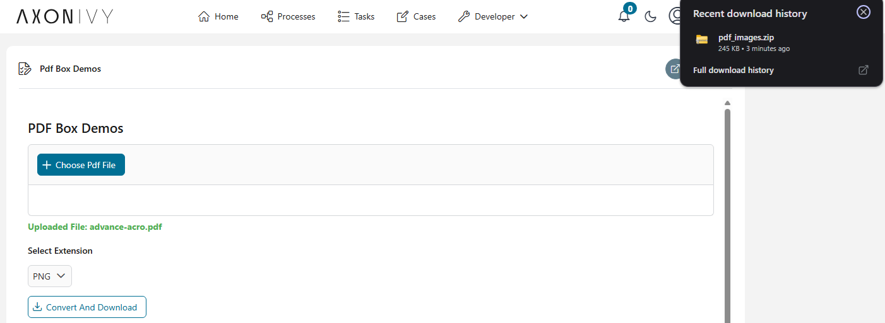
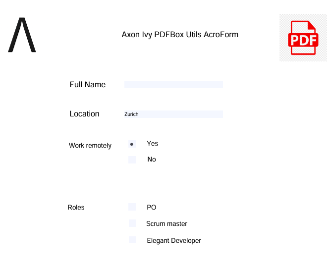
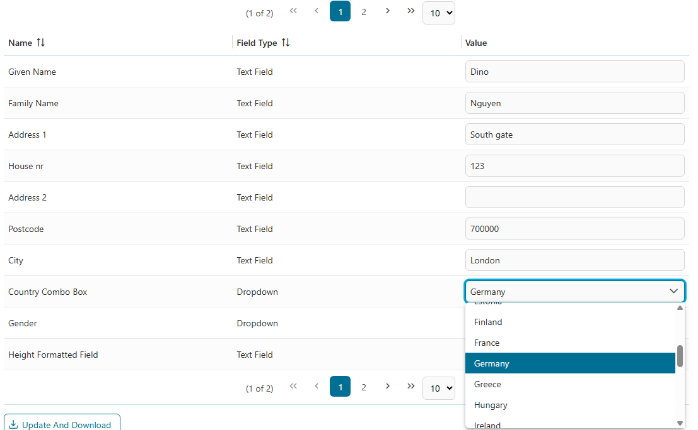
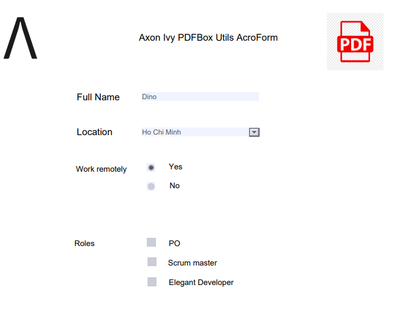

# PDF Box Utils

The **PDF Box Utils** is a powerful utility library for the Axon Ivy platform, built on top of the industry-standard [Apache PDFBox](https://pdfbox.apache.org/). It simplifies specific PDF-related tasks and is recommended for the use cases listed below.

### Key Features

- 🖼️ **PDF to Image Conversion**: Transform PDF pages into high-quality images (PNG, JPG, etc.) with customizable DPI settings.
- 📝 **AcroForm Management**: Programmatically fill and update PDF form fields with dynamic data.
- 📦 **Batch Processing & Zipping**: Automatically package converted images into a single ZIP archive for efficient handling.

For most document processing use cases, we recommend using our [DocFactory](https://market.axonivy.com/doc-factory) as the all-in-one solution.
If you do not want to download the full SDK, you can alternatively use the partial solutions [Axon Ivy PDF](https://market.axonivy.com/axonivy-pdf), [Axon Ivy Words](https://market.axonivy.com/axonivy-words) or [Axon Ivy Cells](https://market.axonivy.com/axonivy-cells).

We also conducted performance tests using two PDF files with different sizes and page counts:

||file A|file B|
|----|-----|-----|
|Number of pages| 12 | 120 |
|Size | 10 MB | 100 MB |

The measured results are shown below:

||Processing Time (A - B) | Processing Time/Page (A - B) | Processing Speed (MB/s) |
|----|-----|-----|-----|
|PDF Box (this connetor)              | 3.8 s - 37.0 s     | 0.3 s - 0.3 s | 2.7 MB/s - 2.7 MB/s |
|Axon Ivy PDF (Based on Aspose library)| 14.7 s - 109.7 s | 1.2 s - 0.9 s | 0.7 MB/s - 0.9 MB/s |

## Demo

The PDF Box Utils includes comprehensive demo processes showcasing all available functionality:

### 1. PDF to Image Conversion
Convert your PDF documents into a collection of images in just a few steps:
1. **Upload**: Select your PDF file.
2. **Configure**: Choose your desired image format (e.g., PNG, JPG).
3. **Download**: Click the "Convert And Download" button to receive a ZIP file containing all pages as images.

### 2. AcroForm Field Updates
Easily manipulate PDF forms:
1. **Upload**: Provide a PDF containing an AcroForm.

2. **Edit**: Modify the field values directly in the UI.

3. **Generate**: Click the "Update And Download" button to get the modified PDF document.

