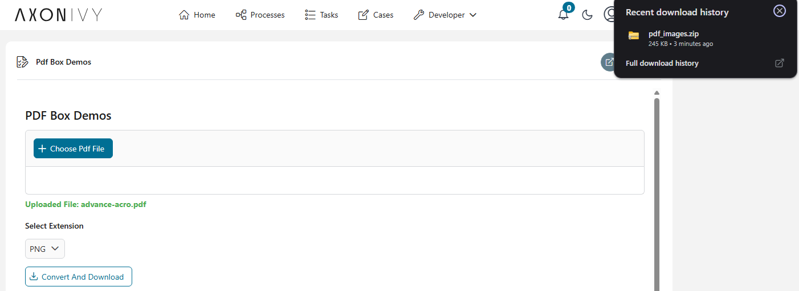
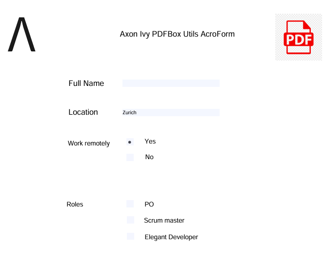

# PDF Box Utils

PDF Box Utils brings simple PDF document automation to Axon Ivy: convert pages to images, fill PDF form fields, and package results for download. It helps teams automate document workflows without heavy manual effort.

### Key features

- Convert PDF pages to high-quality images (PNG/JPG) with configurable DPI.
- Programmatically fill and update AcroForm fields to automate form completion.
- Batch export pages and bundle outputs into a single ZIP archive for easy download and distribution.

## Demo

The product includes demo processes that show typical user workflows used in the pdf-box-demo module.

### PDF to Image Conversion

1. Upload: Select a PDF document in the UI.
2. Configure: Choose image format (PNG/JPG) and desired DPI.
3. Convert & Download: Convert pages and download a ZIP with each page as an image.



### AcroForm Field Updates

1. Upload: Provide a PDF that contains an AcroForm.
2. Edit: Change field values in the UI.
3. Generate: Download the updated PDF.



## Setup

Install using the installers defined in this module's product.json (maven-import and maven-dependency). The product.json references the IARs and Maven artifacts required to add this product to your Axon Ivy project.

```
@variables.yaml@
```

## Components

### Callables

No callable processes found in the main module (pdf-box).

### Form components

No form components detected in the main module (pdf-box).

### REST clients / OpenAPI

No REST clients defined in pdf-box/config/rest-clients.yaml.

### Maven artifacts

```xml
<!-- Installers from product.json -->
<!-- maven-import: IAR project -->
<project>
  <groupId>com.axonivy.utils.pdfbox</groupId>
  <artifactId>pdf-box-demo</artifactId>
  <version>${version}</version>
  <type>iar</type>
</project>

<!-- maven-dependency -->
<dependency>
  <groupId>com.axonivy.utils.pdfbox</groupId>
  <artifactId>pdf-box</artifactId>
  <version>${version}</version>
  <type>iar</type>
</dependency>
```

